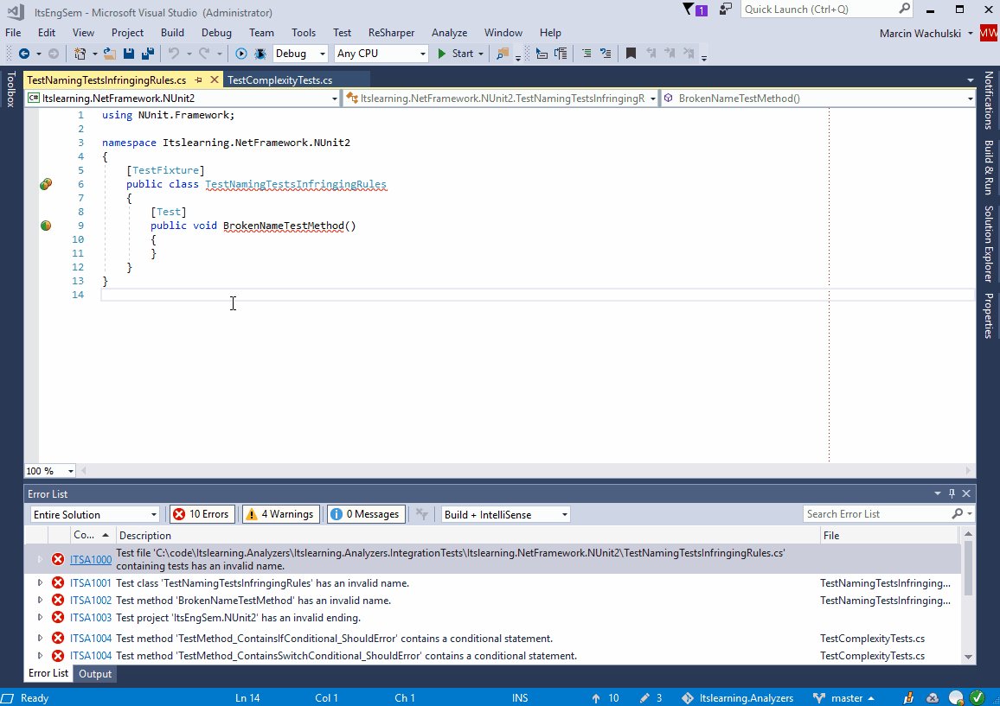

# Itslearning code analyzers

This is the code repository for a Roslyn based nuget library and a Visual Studio extension that help itslearning AS keep high standards of its codebase. Automatically.

## How it works

## How can I (or my organization) make use of it?

#### As nuget development utility

Install [nuget package](https://www.nuget.org/packages/Itslearning.Analyzers). This will add a Roslyn analyzer to your project that will take care of keeping your code aligned to itslearning coding guidelines.

#### As IDE-wide Visual Studio extension (VSIX)

Install the VS extension from the [Marketplace](https://marketplace.visualstudio.com/items?itemName=itslearning.itslearning-roslyn-analyzers-csharp). It will analyse all your projects while they are open in the IDE.

## Code quality rules reference

Please visit [this](RULES.md) page for a complete reference of rules available.

## Contributing

You can contribute by submitting ideas/issues and by discussing it together afterwards.

## Copyright

Copyright © 2017 itslearning AS

## License

Itslearning Analyzers is licensed under Apache License 2.0. See [LICENSE](LICENSE) for more information.